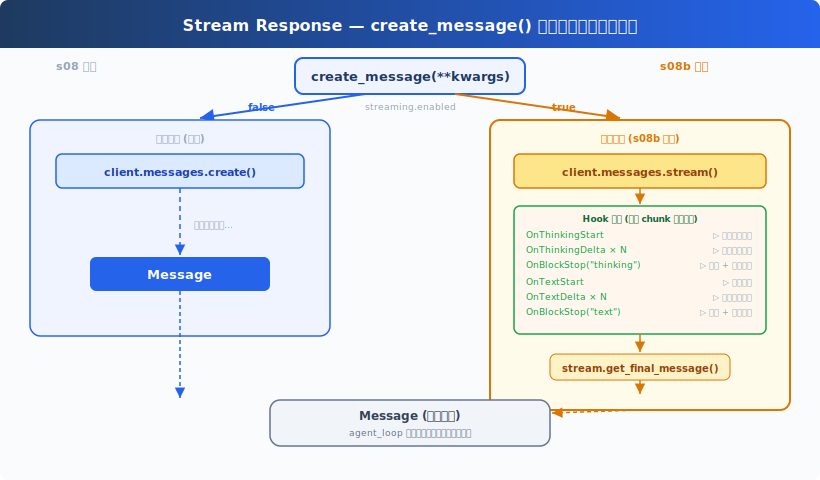
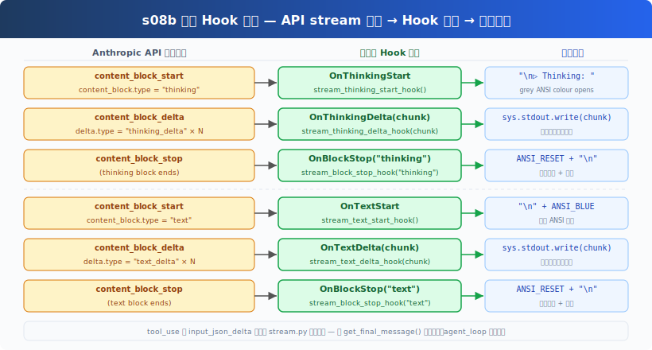

# s08b: Stream Response — Watch tokens arrive, don't wait for the full reply

[中文](README.md) · [English](README.en.md)

s01 → ... → s07 → s08 → `s08b` → [s09](../s09_memory/) → ...

> *"Don't wait for the full reply — watch it arrive"* — drop-in wrapper + 5 Hook events, zero behavior change when off.
>
> **Harness Layer (s08 branch)**: Streaming Response — real-time printing of thinking and text.

---

## About the name

`s08b` is a **branch feature** off s08, not the next step in the main sequence:

- The `b` stands for "branch off s08"; the s01–s20 main-line numbers stay intact;
- In any filesystem sorted alphabetically, `s08b_` naturally falls between `s08_context_compact` and `s09_memory`;
- With `streaming.enabled: false` the behavior is identical to s08 — this lesson can be skipped entirely.

---

## The Problem

s08's LLM call is blocking:

```python
response = client.messages.create(...)   # wait until the full response arrives
```

For reasoning-heavy models (claude-opus-4, claude-3-7-sonnet with extended thinking),
a single response can take 30–60 seconds. During that time the terminal shows **nothing**:
the user can't tell whether the model is still thinking or has stalled.

---

## The Solution



Core design: `create_message(**kwargs)` is a transparent replacement for `client.messages.create(**kwargs)`.

- **Off** (`streaming.enabled: false`, default): calls `client.messages.create()` directly — identical to s08;
- **On** (`streaming.enabled: true`): switches to `client.messages.stream()`, fires Hook events on each chunk for immediate terminal output, then calls `get_final_message()` and returns the same `Message` object;
- **`agent_loop` unchanged**: the return type is the same; the main loop is unaware of which path was taken.

---

## How It Works

### create_message: two paths

```
create_message(**kwargs)
        │
        ├─ streaming.enabled=false ──→ client.messages.create()
        │                                       │ (blocks until complete)
        │                                     Message
        │
        └─ streaming.enabled=true ───→ client.messages.stream()
                                                │
                                          event loop
                                                │ OnThinkingStart  → hook
                                                │ OnThinkingDelta  → hook × N
                                                │ OnBlockStop      → hook
                                                │ OnTextStart      → hook
                                                │ OnTextDelta      → hook × N
                                                │ OnBlockStop      → hook
                                                │
                                         get_final_message()
                                                │
                                             Message  ← same type, agent_loop unaware
```

The implementation:

```python
def create_message(**kwargs):
    cfg = load_config().get("streaming", {})

    if not cfg.get("enabled", False):
        return client.messages.create(**kwargs)   # batch path, untouched

    # Streaming path: event loop → Hooks → same Message return
    _state = {"block_type": None}

    def _dispatch(event):
        etype = getattr(event, "type", None)
        if etype == "content_block_start":
            btype = getattr(getattr(event, "content_block", None), "type", None)
            _state["block_type"] = btype
            if btype == "thinking": fire("OnThinkingStart")
            elif btype == "text":   fire("OnTextStart")
        elif etype == "content_block_delta":
            delta = getattr(event, "delta", None)
            if delta:
                if delta.type == "thinking_delta": fire("OnThinkingDelta", delta.thinking)
                elif delta.type == "text_delta":   fire("OnTextDelta",     delta.text)
        elif etype == "content_block_stop":
            fire("OnBlockStop", _state["block_type"])

    with client.messages.stream(**kwargs) as stream:
        for event in stream:
            _dispatch(event)
        return stream.get_final_message()
```

### 5 new Hook events



All 5 new events fire only when `streaming.enabled=true`. The existing `OnThinking` event (s08, full ThinkingBlock in batch mode) is preserved unchanged.

`show_thinking_hook` (the `OnThinking` handler) gains a streaming guard:

```python
def show_thinking_hook(block):
    # Skip: streaming already displayed thinking live via OnThinkingDelta
    if load_config().get("streaming", {}).get("enabled", False):
        return None
    if load_config().get("show_thinking", True):
        print(f"[HOOK] Thinking: {block.thinking}\n")
    return None
```

### Guards in agent_loop

In streaming mode text was already printed character-by-character via `OnTextDelta`,
so the batch-mode print statements need to be skipped:

```python
# InplusCode.py — inside the tool_use branch
elif block.type == "text":
    if not load_config().get("streaming", {}).get("enabled", False):
        print(f"[blue]{block.text}[/blue]\n")

# __main__ — final text after agent_loop returns
if not load_config().get("streaming", {}).get("enabled", False):
    for block in response_content:
        if getattr(block, "type", None) == "text":
            print(f"\n{block.text}")
```

### Extended thinking (optional)

Set `thinking_budget` in config.yaml and `create_message` will inject the `thinking` parameter:

```python
thinking_budget = cfg.get("thinking_budget")
if thinking_budget and "thinking" not in kwargs:
    kwargs = {**kwargs, "thinking": {"type": "enabled", "budget_tokens": int(thinking_budget)}}
```

> **Note**: extended thinking requires a supported model (claude-3-7-sonnet / claude-opus-4, etc.)
> and `max_tokens` must exceed `thinking_budget`. Without configuration this is a no-op.

---

## Enabling streaming

In `scripts/config.yaml`:

```yaml
streaming:
  enabled: true           # enable live streaming
  show_thinking: true     # stream thinking chunks (dim grey)
  show_text: true         # stream text chunks (blue)
  # thinking_budget: 8000 # optional: enable extended thinking (token budget)
```

---

## Changes from s08

| Component | s08 | s08b |
|-----------|-----|------|
| LLM call | `client.messages.create()` | `create_message()` (transparent wrapper) |
| New file | — | `utils/stream.py` |
| Hook events | 6 (includes `OnThinking`) | 11 (5 new streaming events) |
| `hooks.py` | `show_thinking_hook` has no guard | adds streaming guard to avoid duplicate print |
| `InplusCode.py` | `client.messages.create()` | `create_message()` + text print guards |
| `config.yaml` | no streaming section | new `streaming` config block |
| Return type | `Message` | `Message` (unchanged) |
| Default behavior | batch | batch (`enabled: false`, zero breakage) |

Unchanged: `agent_loop` structure, four-layer compaction pipeline, all tools, all existing Hook logic.
